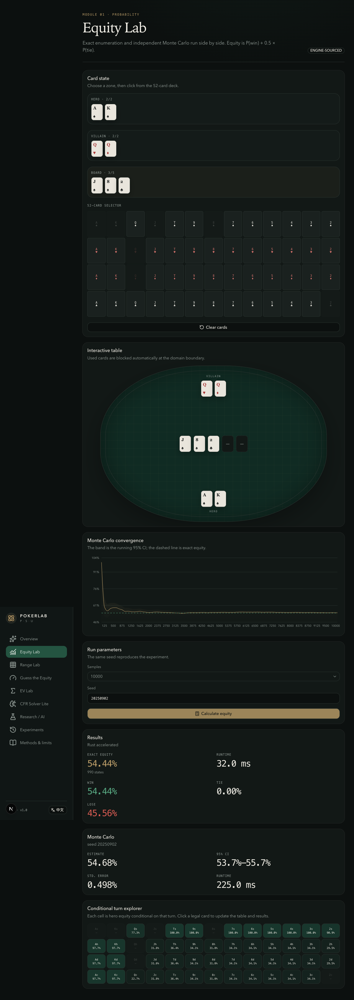
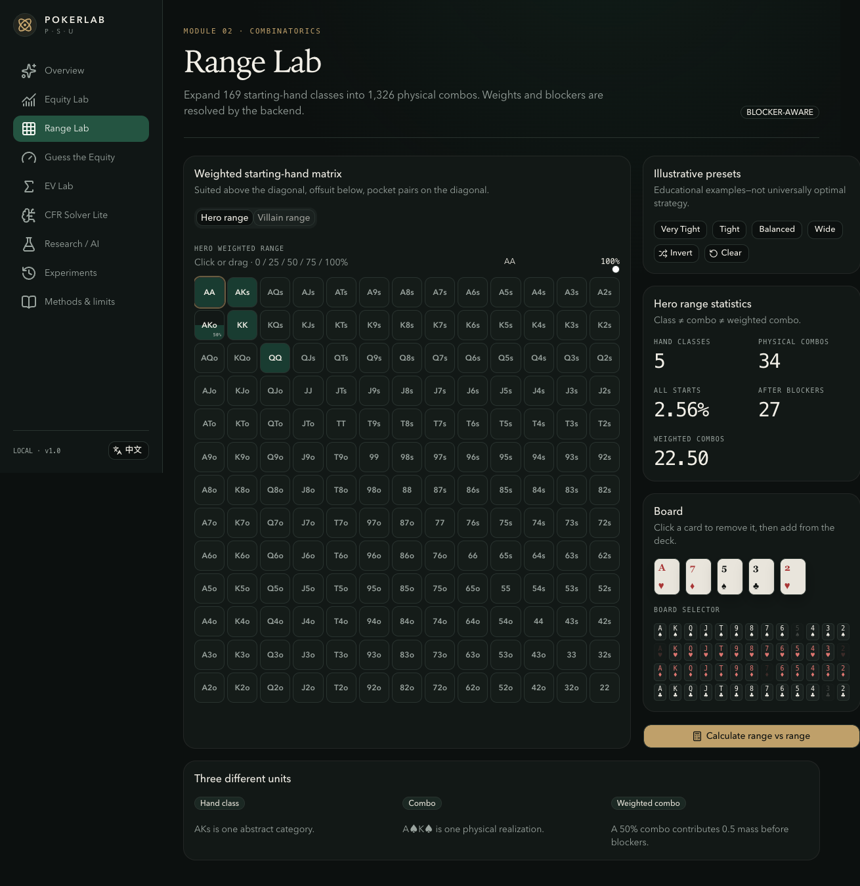
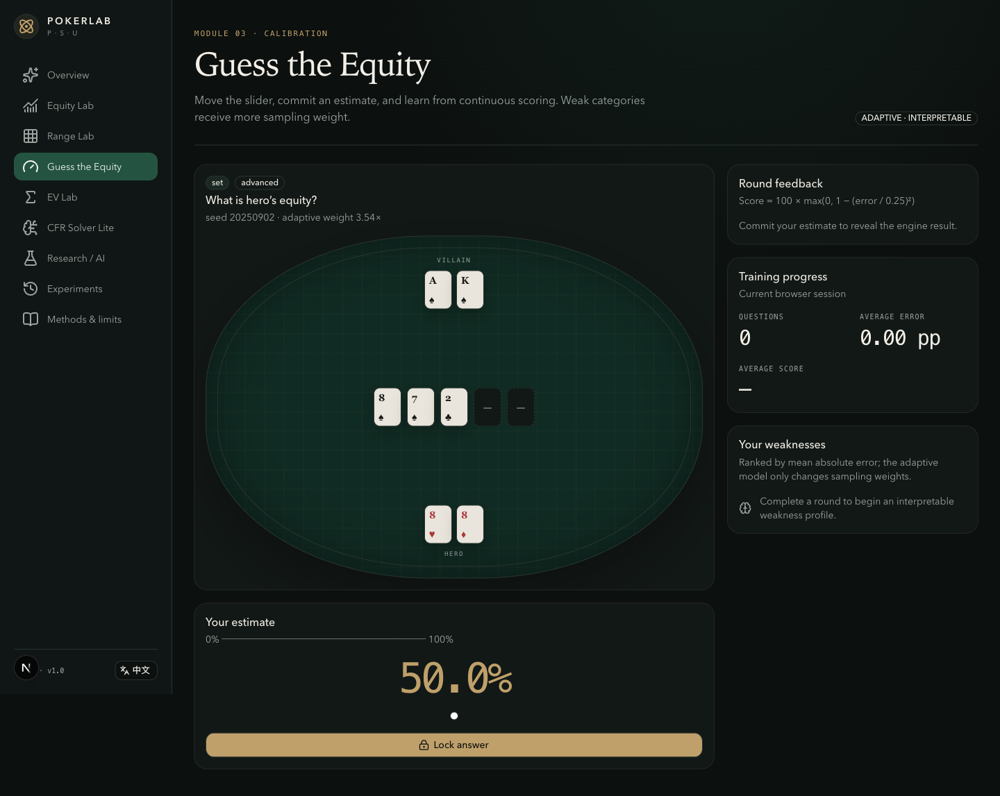
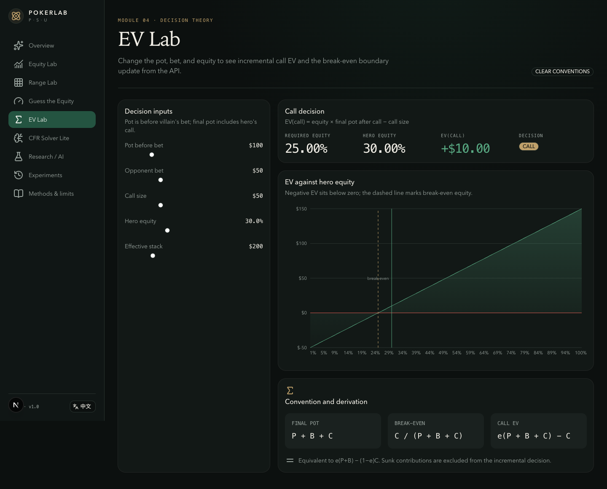
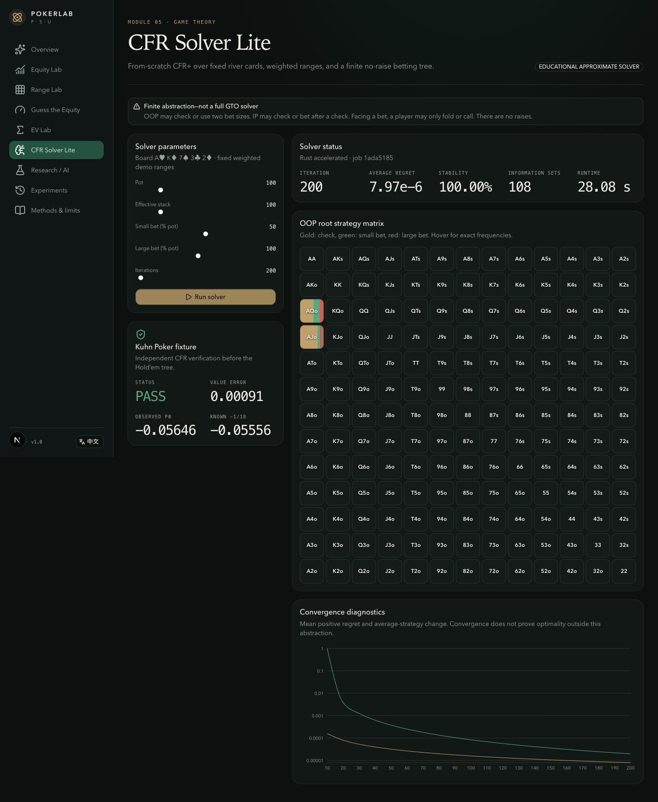
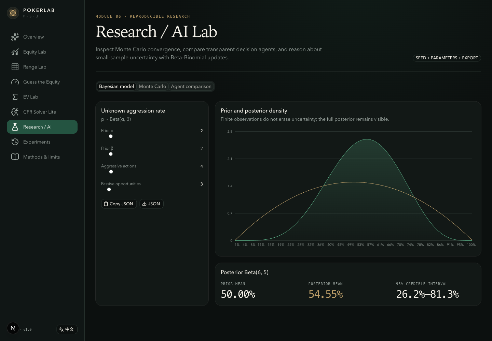
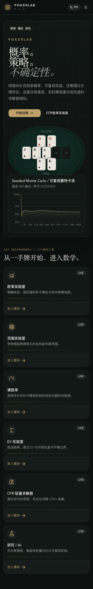
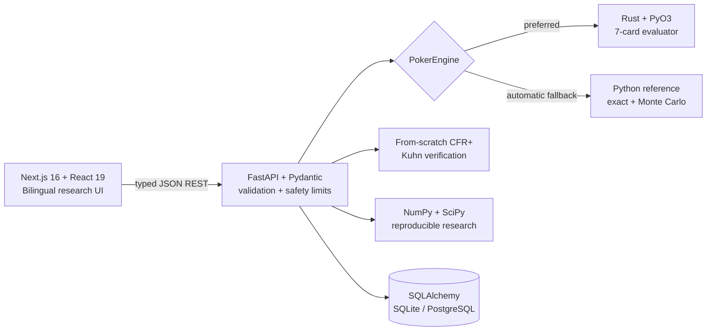

<div align="center">

# PokerLab

### Probability. Strategy. Uncertainty.

**A bilingual, local-first research instrument for Hold’em probability, reproducible simulation, decision theory, and finite game solving.**<br>
**一个双语、本地优先的德州扑克概率、可复现模拟、决策理论与有限博弈研究工具。**

[](https://github.com/kyky2347/pokerlab/actions/workflows/ci.yml)
[](LICENSE)
[](apps/api/pyproject.toml)
[](apps/web/package.json)
[](rust-toolchain.toml)

[Quick start / 快速开始](#quick-start--快速开始) · [Architecture / 架构](#architecture--架构) · [Validation / 验证](#validation--验证) · [Download ZIP](https://github.com/kyky2347/pokerlab/archive/refs/heads/main.zip)

</div>


## What makes PokerLab different / 为什么是 PokerLab

PokerLab is designed as an inspectable research system—not a casino skin and not a collection of disconnected calculators. The browser never invents canonical poker results: every displayed equity, confidence interval, strategy, and experiment record comes from the typed API and the tested poker core.

PokerLab 是一套可审查的研究系统，而不是赌场风格外壳或互不关联的小工具集合。浏览器不会自行生成“官方结果”；界面中的胜率、置信区间、策略和实验记录均来自类型化 API 与经过测试的扑克核心。

- **One source of mathematical truth / 单一数学真值源** — Python reference evaluator plus a cross-checked Rust/PyO3 accelerator.
- **Reproducible by construction / 从设计上可复现** — stochastic runs store their seed, parameters, engine, runtime, and result.
- **Real finite solving / 真实有限求解** — CFR+ is implemented in this repository and verified against Kuhn Poker; no third-party solver is used.
- **Honest limits / 坦诚展示边界** — the river solver’s no-raise abstraction is visible in the UI and documentation.
- **Local-first / 本地优先** — SQLite works out of the box; PostgreSQL and Docker Compose are supported without making cloud accounts mandatory.
- **English and Chinese / 中英双语** — the product shell, primary workflows, safety copy, and documentation are available in both languages.

## Product tour / 功能导览

| Instrument / 工具                    | What it does / 功能                                                                                                                                                                                          |
| ------------------------------------ | ------------------------------------------------------------------------------------------------------------------------------------------------------------------------------------------------------------ |
| **Equity Lab / 胜率实验室**          | Exact legal-runout enumeration, seeded Monte Carlo, variance, standard error, 95% confidence intervals, and a conditional turn map. / 精确枚举、固定种子蒙特卡洛、方差、标准误、95% 置信区间与条件转牌地图。 |
| **Range Lab / 范围实验室**           | A weighted 13×13 range matrix, physical blockers, combo accounting, and range-vs-range equity. / 13×13 加权范围矩阵、物理阻断牌、组合统计与范围对范围胜率。                                                  |
| **Guess the Equity / 猜胜率**        | Legal scenarios, continuous quadratic scoring, and an interpretable weakness-weighted sampler. / 合法牌局、连续二次评分与可解释的薄弱项加权出题。                                                            |
| **EV Lab / EV 实验室**               | Explicit pot conventions, break-even equity, incremental call EV, and decision curves. / 明确的底池约定、盈亏平衡胜率、增量跟注 EV 与决策曲线。                                                              |
| **CFR Solver Lite / CFR 轻量求解器** | A real blocker-aware CFR+ river abstraction with mixed strategies and convergence diagnostics. / 真实运行、阻断牌感知的河牌 CFR+ 抽象、混合策略与收敛诊断。                                                  |
| **Research / AI / 研究实验室**       | Beta–Binomial inference, seeded convergence exports, and transparent agent comparisons. / Beta–Binomial 推断、固定种子收敛导出与透明代理对比。                                                               |
| **Experiment ledger / 实验台账**     | SQLite/PostgreSQL persistence with complete JSON and CSV export. / SQLite/PostgreSQL 持久化及完整 JSON、CSV 导出。                                                                                           |

<details>
<summary><strong>Open the visual gallery / 展开界面画廊</strong></summary>

### Equity and ranges / 胜率与范围





### Training and decision theory / 训练与决策理论





### Game theory and research / 博弈论与研究





### Mobile Chinese interface / 移动端中文界面



</details>

## Quick start / 快速开始

### One command: launch the complete system / 一条命令启动完整系统

Install and start Docker Desktop, then run the repository launcher from the project directory:

安装并启动 Docker Desktop，然后在项目目录执行仓库启动器：

```bash
./pokerlab
```

That single command generates a private local database credential, builds and starts PostgreSQL, the Rust-accelerated API, and the production web app, waits for every health check, then opens PokerLab in the default browser.

这一条命令会生成仅保存在本机的随机数据库凭据，构建并启动 PostgreSQL、Rust 加速 API 与生产 Web 应用，等待全部健康检查通过，然后在默认浏览器中打开 PokerLab。

```bash
./pokerlab status          # service health / 服务状态
./pokerlab logs            # live logs / 实时日志
./pokerlab stop            # stop and preserve data / 停止并保留数据
./pokerlab start --no-open # headless start / 启动但不打开浏览器
```

### Native development / 本地开发

Prerequisites / 环境要求:

- Node.js 24+
- pnpm 11+
- Python 3.12 and [uv](https://docs.astral.sh/uv/)
- Rust 1.88+ for the accelerator; the API preserves an automatic Python fallback if the compiled extension cannot load. / Rust 用于加速器；若扩展运行时无法加载，API 会自动回退到 Python 参考实现。

```bash
git clone https://github.com/kyky2347/pokerlab.git
cd pokerlab
corepack enable
make setup
make dev
```

Open / 打开:

- Product UI / 产品界面: <http://localhost:3000>
- API health / API 健康检查: <http://localhost:8000/health>
- Interactive OpenAPI / 交互式 API 文档: <http://localhost:8000/docs>

### Manual container control / 手动控制容器

```bash
cp .env.example .env
# Replace POSTGRES_PASSWORD in .env with a random local value.
# 将 .env 中的 POSTGRES_PASSWORD 替换为随机本地值。
docker compose --env-file .env up --build
```

The `./pokerlab` launcher is recommended because it creates the ignored runtime credential securely, waits for health checks, and opens the product automatically. For manual Compose control, stop with `docker compose --env-file .env down`; add `-v` only when you intentionally want to remove the database volume.

推荐使用 `./pokerlab`，因为它会安全生成被 Git 忽略的运行凭据、等待健康检查并自动打开产品。手动使用 Compose 时，以 `docker compose --env-file .env down` 停止；只有明确需要删除数据库卷时才追加 `-v`。

## Architecture / 架构



The API is the canonical result source. The frontend owns interaction and visualization, but never calculates canonical equity. Rust and Python evaluator outputs are cross-checked on seeded seven-card samples. See [architecture](docs/architecture.md), [mathematical notes](docs/math), and [solver limitations](docs/solver-limitations.md).

API 是结果真值源；前端负责交互与可视化，但不计算权威胜率。Rust 与 Python 评估器会在固定随机样本上交叉验证。详见[架构说明](docs/architecture.md)、[数学说明](docs/math)与[求解器边界](docs/solver-limitations.md)。

## Mathematical contract / 数学契约

- Equity / 胜率: `E = P(win) + 0.5 × P(tie)`
- Monte Carlo / 蒙特卡洛: `Êₙ = (1/n) ΣXᵢ`, where `Xᵢ ∈ {0, 0.5, 1}`
- Call EV / 跟注 EV: `EV(call) = e(P + B + C) − C`
- Bayesian update / 贝叶斯更新: `Beta(α, β) → Beta(α+s, β+f)`
- CFR+ regret matching / CFR+ 遗憾匹配: `σ(a) ∝ max(R(a), 0)`

Duplicate cards are rejected at the domain boundary. Monte Carlo samples legal runouts without replacement inside each trial. Range equity removes blocker collisions before normalization. / 重复牌会在领域边界被拒绝；蒙特卡洛在每次试验内进行无放回合法补牌采样；范围胜率会在归一化前移除阻断冲突。

## Validation / 验证

Run the complete local quality gate / 运行完整本地质量门禁:

```bash
make check
pnpm --filter web test:e2e
```

The suite covers evaluator ordering, wheel straights, duplicate rejection, exact-equity symmetry, deterministic seeds, Monte Carlo statistical tolerance, weighted blockers, canonical range aliases, Rust/Python cross-checks, EV geometry, CFR strategy normalization, Kuhn convergence, structured API errors, component behavior, desktop workflows, and mobile overflow.

测试覆盖牌力排序、A2345 顺子、重复牌拒绝、精确胜率对称性、固定种子、蒙特卡洛统计容差、加权阻断、范围别名、Rust/Python 交叉验证、EV 几何、CFR 策略归一化、Kuhn 收敛、结构化 API 错误、组件交互、桌面流程与移动端溢出。

GitHub Actions runs formatting, linting, type checks, Python/Rust/frontend tests, production builds, desktop/mobile browser tests, and both container builds on every push and pull request.

## Measured benchmark / 实测基准

These are reproducible observations from `pnpm benchmark`, not universal performance claims. Recorded on macOS ARM with Python 3.12 using the Python reference path:

| Workload / 工作负载                             |    Observed / 实测 |
| ----------------------------------------------- | -----------------: |
| Seven-card evaluation / 七张牌评估              |      22,317 eval/s |
| Exact flop scenario, 990 runouts / 翻牌精确场景 |  10.95 scenarios/s |
| Monte Carlo / 蒙特卡洛                          |   10,561 samples/s |
| One-class river range equity / 单类河牌范围胜率 | 145.97 scenarios/s |
| CFR one-class iteration / 单类 CFR 迭代         | 34.10 iterations/s |

Methodology and caveats / 方法与限制: [research/benchmarks.md](research/benchmarks.md)

## Repository map / 仓库结构

```text
apps/web/                 Next.js product UI and browser tests
apps/api/                 FastAPI, reference engine, CFR, research, persistence
packages/poker-core/      Rust evaluator and PyO3 extension
docs/math/                Inspectable mathematical definitions
research/                 Measured benchmark record
infra/                    Reproducible container builds
.github/workflows/        Continuous quality gates
```

## Scope and responsible use / 范围与负责任使用

The solver is heads-up, river-only, fixed-board, fixed-range, and no-raise. Its displayed regret is a convergence diagnostic—not rigorous exploitability. PokerLab does not implement payments, deposits, casino integration, screen capture, real-time play advice, or automated betting.

求解器仅覆盖单挑、河牌、固定公共牌、固定范围与无加注树；显示的遗憾值是收敛诊断，不是严格 exploitability。本项目不实现支付、存款、赌场接入、屏幕抓取、实时牌局建议或自动下注。

## Contributing and security / 贡献与安全

Read [CONTRIBUTING.md](CONTRIBUTING.md) before proposing mathematical or behavioral changes. Report vulnerabilities according to [SECURITY.md](SECURITY.md). Released under the [MIT License](LICENSE).

提交数学或行为变更前请阅读 [CONTRIBUTING.md](CONTRIBUTING.md)；安全问题请按 [SECURITY.md](SECURITY.md) 报告。本项目使用 [MIT License](LICENSE)。
