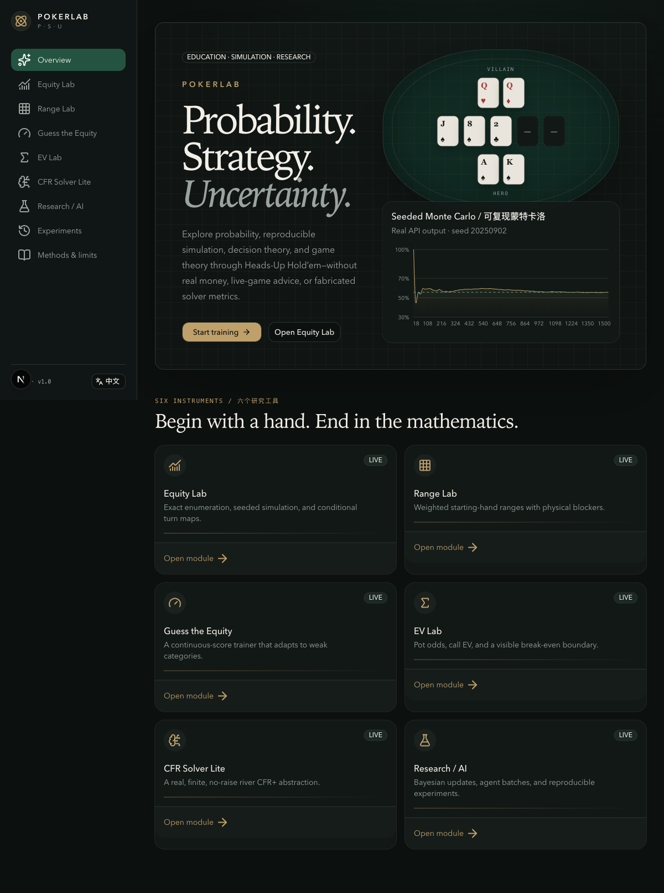
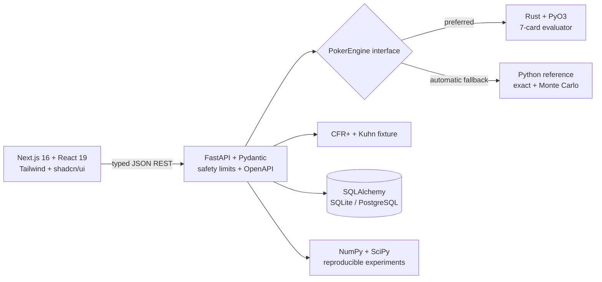

<div align="center">

# POKERLAB

### Probability. Strategy. Uncertainty.

**A bilingual, local-first research instrument for Hold'em probability, simulation, decision theory, and finite game solving.**  
**一个双语、本地优先的德州扑克概率、模拟、决策理论与有限博弈研究工具。**

No real money · No live-game assistance · No fabricated statistics  
无真钱 · 无实时牌局辅助 · 无伪造统计

</div>



## What is inside / 功能

- **Equity Lab** — exact legal-runout enumeration, independent seeded Monte Carlo, sample variance, standard error, 95% confidence intervals, real convergence paths, and a 52-card conditional turn explorer.
- **Range Lab** — a draggable 13×13 weighted range matrix, illustrative presets, physical and weighted combo statistics, blockers, and range-vs-range equity.
- **Guess the Equity** — legal generated scenarios, continuous quadratic scoring, session tracking, and a simple interpretable weakness-weighted sampler.
- **EV Lab** — explicit pot conventions, break-even equity, incremental call EV, and an API-sourced decision curve.
- **CFR Solver Lite** — a from-scratch CFR+ river abstraction, real blocker-aware showdowns, Kuhn Poker verification, mixed strategy matrices, and convergence diagnostics.
- **Research / AI Lab** — Beta–Binomial opponent inference, Monte Carlo exports, and reproducible comparisons of transparent educational agents.
- **Experiment ledger** — SQLite/Postgres persistence of parameters, seed, engine, runtime, and results with JSON/CSV export.

核心功能均可在没有云账号或付费服务的情况下运行。Rust 扩展不可用时会明确回退到 Python 参考实现。

## Architecture / 架构



The backend is the canonical probability source. The frontend presents controls and charts but never independently declares official equity. See [architecture](docs/architecture.md) and [solver limitations](docs/solver-limitations.md).

## Quick start / 快速启动

Prerequisites: Node 24+, pnpm 11+, and `uv`. Rust is optional at runtime.

```bash
pnpm install
cd apps/api && uv sync && cd ../..
pnpm dev
```

Open:

- Web: <http://localhost:3000>
- API health: <http://localhost:8000/health>
- OpenAPI: <http://localhost:8000/docs>

Build the optional Rust accelerator:

```bash
cd apps/api
uv run maturin develop --manifest-path ../../packages/poker-core/Cargo.toml --features python
```

## Mathematical foundations / 数学基础

PokerLab uses (E=P(\text{win})+\frac12P(\text{tie})). Monte Carlo outcomes are (X_i\in\{0,\frac12,1\}), with estimator (\hat E_n=n^{-1}\sum_iX_i) and standard error (s/\sqrt n). Bayesian aggression uses the conjugate update (\text{Beta}(\alpha,\beta)\to\text{Beta}(\alpha+s,\beta+f)). Call EV is (e(P+B+C)-C). CFR+ matches positive cumulative counterfactual regret at every information set.

完整推导：[equity](docs/math/equity.md) · [Monte Carlo](docs/math/monte-carlo.md) · [expected value](docs/math/expected-value.md) · [Bayesian](docs/math/bayesian.md) · [CFR](docs/math/cfr.md)

## Observed benchmarks / 实测基准

Measured locally on macOS 26.5.2 ARM, Python 3.12.13, Python reference engine. These are observations from `pnpm benchmark`, not portable performance claims.

| Workload | Observed throughput |
|---|---:|
| Seven-card hand evaluation | 22,317 eval/s |
| Exact flop equity scenario (990 runouts) | 10.95 scenarios/s |
| Monte Carlo equity | 10,561 samples/s |
| One-class river range-vs-range scenario | 145.97 scenarios/s |
| CFR iteration, one-class ranges | 34.10 iterations/s |

Raw methodology and caveats are in [research/benchmarks.md](research/benchmarks.md).

## Test and quality commands / 测试

```bash
pnpm --filter web lint
pnpm --filter web typecheck
pnpm --filter web test
pnpm --filter web build
cd apps/api && uv run ruff check . && uv run pytest
cargo fmt --manifest-path packages/poker-core/Cargo.toml --check
cargo test --manifest-path packages/poker-core/Cargo.toml
pnpm --filter web test:e2e
```

Coverage includes evaluator ordering, duplicate rejection, deck uniqueness, exact-equity invariants, player-swap symmetry, deterministic seeds, Monte Carlo tolerance, blockers, range normalization, continuous EV, Kuhn convergence, regret normalization, API flows, component interaction, desktop journeys, and mobile overflow.

## Repository map / 目录

```text
apps/web/                 Next.js bilingual product UI
apps/api/                 FastAPI, reference engine, persistence, CFR, research
packages/poker-core/      Rust evaluator and PyO3 extension
docs/math/                Inspectable mathematical definitions
research/                 Measured benchmark record
infra/                    Production container recipes
.github/workflows/        CI quality gates
```

## Limits / 限制

The solver is river-only, heads-up, fixed-board, fixed-range, and no-raise. Its regret metric is not rigorous exploitability. The adaptive trainer is a transparent reweighting heuristic, not a learned opponent model. Normal confidence intervals are approximations. SQLite is intended for local use; choose PostgreSQL for multi-process deployment.

本项目是教育与研究软件，不实现支付、存款、赌场接入、屏幕抓取、实时牌局建议或自动下注。

## Optional integrations / 可选集成

Core functionality has no cloud dependency. `DATABASE_URL` can select Postgres. `SENTRY_DSN` is reserved for optional monitoring. Deployment details are in [docs/deployment.md](docs/deployment.md).
