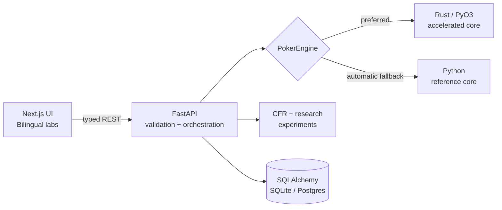

# PokerLab architecture / 架构

PokerLab is a local-first pnpm monorepo. The architecture enforces one mathematical source of truth while keeping the product usable without cloud credentials.

PokerLab 是一个本地优先的 pnpm monorepo。架构保证数学结果只有一个真值源，同时无需云端凭据即可使用。

## Boundaries / 边界

- `apps/web`: presentation, accessibility, client/server state, charts. It never declares canonical poker equity.
- `apps/api`: Pydantic contracts, safety limits, experiment orchestration, structured persistence.
- `packages/poker-core`: Rust card representation and evaluator exposed through PyO3.
- `research`: reproducible experiment notes and measured benchmark outputs.
- `tests`: cross-layer smoke and mathematical invariant coverage.

## Failure behavior / 故障行为

The API tries `RustPokerEngine` at startup. Import or runtime failure selects `PythonPokerEngine`, records that choice in diagnostics, and never substitutes fabricated results. `DATABASE_URL` defaults to SQLite; any remote Postgres URL remains optional.

API 启动时优先加载 `RustPokerEngine`。若导入或运行失败，则显式切换到 `PythonPokerEngine` 并在诊断页展示；绝不伪造结果。`DATABASE_URL` 默认使用 SQLite，远程 Postgres 完全可选。

Database initialization is different from engine fallback: a failed configured database stops startup rather than redirecting records to a new ledger. Packaged migrations run transactionally before request handling, with a PostgreSQL advisory lock or SQLite immediate transaction to serialize concurrent worker startup. The trainer persists issued questions and conditionally claims each question inside the same transaction as its score. Experiment history uses an indexed, deterministic `(created_at, id)` order and explicitly UTC timestamps on both database backends.

数据库初始化与引擎回退相互独立：指定数据库失败会停止启动，而不是把记录重定向到新台账。随包迁移在接收请求前以事务执行，并通过 PostgreSQL advisory lock 或 SQLite immediate transaction 串行化多进程启动。训练器持久化已出题目，条件领取题目与写入评分在同一事务完成。实验台账使用带索引的 `(created_at, id)` 确定性排序，两种数据库均返回明确的 UTC 时间戳。

## Solver boundary / 求解器边界

The river solver uses a finite educational tree: OOP may check or make one of two bets; after a check, IP may check or make one of two bets; the facing player may fold or call. There are no raises. Private information sets are keyed by player, hand class, and public history. Terminal utilities are zero-sum and use actual seven-card showdown ranks.
