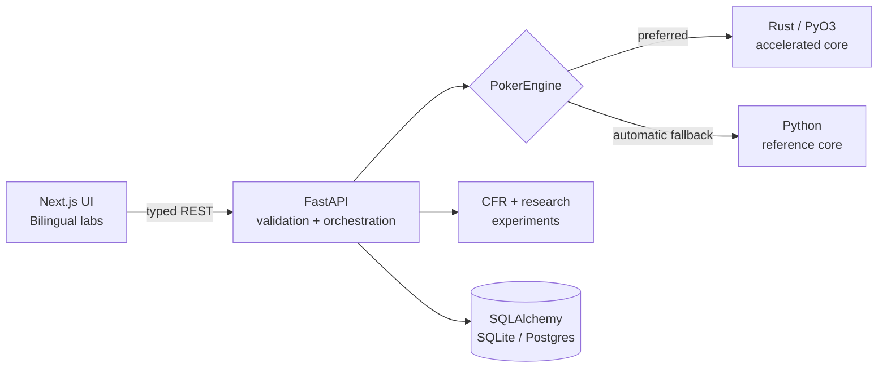

# PokerLab architecture / 架构

PokerLab is a local-first pnpm monorepo. The architecture enforces one mathematical source of truth while keeping the product usable without cloud credentials.

PokerLab 是一个本地优先的 pnpm monorepo。架构保证数学结果只有一个真值源，同时无需云端凭据即可使用。

```mermaid
flowchart LR
  UI[Next.js UI\nBilingual labs] -->|typed REST| API[FastAPI\nvalidation + orchestration]
  API --> ENG{PokerEngine}
  ENG -->|preferred| RS[Rust / PyO3\naccelerated core]
  ENG -->|automatic fallback| PY[Python\nreference core]
  API --> CFR[CFR + research\nexperiments]
  API --> DB[(SQLAlchemy\nSQLite / Postgres)]
```

## Boundaries / 边界

- `apps/web`: presentation, accessibility, client/server state, charts. It never declares canonical poker equity.
- `apps/api`: Pydantic contracts, safety limits, experiment orchestration, structured persistence.
- `packages/poker-core`: Rust card representation and evaluator exposed through PyO3.
- `research`: reproducible experiment notes and measured benchmark outputs.
- `tests`: cross-layer smoke and mathematical invariant coverage.

## Evaluator hot path / 评估器高频路径

Rust still enumerates all 21 five-card subsets of each seven-card hand and returns the same lexicographically ordered category/kicker vector. The public boundary parses cards and rejects wrong lengths and duplicates before evaluation. Only the private subset evaluator reuses this uniqueness guarantee: a fixed rank histogram, stack-resident rank groups, and a straight bitmask replace repeated hash-table allocation and sorting. No lookup database, external evaluator, unsafe code, or approximation is introduced. The Python reference and seeded sampling orchestration are unchanged.

Rust 仍对七张牌枚举全部 21 个五张子集，返回相同的、按字典序比较的牌型/踢脚牌向量。公开入口先解析牌面并拒绝错误数量及重复牌；只有私有子集评估函数复用此唯一性保证。固定点数计数数组、栈内分组和顺子位掩码替代重复哈希表分配与排序，不引入查询数据库、第三方评估器、unsafe 代码或近似算法。Python 参考实现和固定种子抽样流程保持不变。

Every normal Rust test run exhaustively compares **all 2,598,960 physical five-card hands**, including complete kicker vectors, with a frozen test-only copy of the original ranking logic. All 8,192 rank subsets also cross-check straight detection. Python integration tests compare 5,000 seeded seven-card hands, category edge cases, order/suit invariance, invalid extension inputs, and complete Monte Carlo results across both engines. This is exhaustive five-card coverage, **not** enumeration of all seven-card hands or a proof that the full application is bug-free. See [measured benchmarks and reproduction](../research/benchmarks.md#rust-evaluator-hot-path--rust-评估器高频路径--2026-10-03).

每次常规 Rust 测试都会穷举 **全部 2,598,960 种五张实体牌组合**，将包括踢脚牌在内的完整结果与仅用于测试的旧排序逻辑逐一对照；全部 8,192 种点数子集也会验证顺子检测。Python 集成测试另核对 5,000 组固定种子七张牌、牌型边界、顺序/花色不变量、扩展入口非法输入及双引擎完整蒙特卡洛结果。这是五张牌的穷举覆盖，**不是**所有七张牌组合的穷举，也不表示整个应用不存在缺陷。实测与复现方式见上述链接。

## Failure behavior / 故障行为

The API tries `RustPokerEngine` at startup. Import or runtime failure selects `PythonPokerEngine`, records that choice in diagnostics, and never substitutes fabricated results. `DATABASE_URL` defaults to SQLite; any remote Postgres URL remains optional.

API 启动时优先加载 `RustPokerEngine`。若导入或运行失败，则显式切换到 `PythonPokerEngine` 并在诊断页展示；绝不伪造结果。`DATABASE_URL` 默认使用 SQLite，远程 Postgres 完全可选。

Database initialization is different from engine fallback: a failed configured database stops startup rather than redirecting records to a new ledger. Packaged migrations run transactionally before request handling, with a PostgreSQL advisory lock or SQLite immediate transaction to serialize concurrent worker startup. The trainer persists issued questions and conditionally claims each question inside the same transaction as its score. Experiment history uses an indexed, deterministic `(created_at, id)` order and explicitly UTC timestamps on both database backends.

数据库初始化与引擎回退相互独立：指定数据库失败会停止启动，而不是把记录重定向到新台账。随包迁移在接收请求前以事务执行，并通过 PostgreSQL advisory lock 或 SQLite immediate transaction 串行化多进程启动。训练器持久化已出题目，条件领取题目与写入评分在同一事务完成。实验台账使用带索引的 `(created_at, id)` 确定性排序，两种数据库均返回明确的 UTC 时间戳。

The browser history uses `/experiments/page`: a bounded keyset query reads metadata only, never the `parameters` or `results` JSON columns. A cursor carries the last timestamp/ID, so newer inserts do not duplicate entries on subsequent older pages; deletion of the boundary row does not invalidate the cursor. This is not a frozen database snapshot. The selected record is fetched separately from `/experiments/{id}/export` as server-formatted text, preserving 64-bit integers without a JavaScript parse/stringify round-trip. Superseded browser requests are cancelled, and history/detail failures have independent retry states. See [the API contract](experiment-history.md).

浏览器历史使用 `/experiments/page`：有上限的键集分页查询只读取元数据，不读取 `parameters` 和 `results` JSON 列。游标携带上一页末尾的时间戳与 ID，较新的插入不会让后续旧页出现重复；边界记录被删除也不会使游标失效。这不是冻结的数据库快照。选中记录通过 `/experiments/{id}/export` 单独获取服务端格式化文本，不经过 JavaScript 解析/重组，从而保留 64 位整数。过时的浏览器请求会取消；历史与详情加载失败分别提供重试。详见 [API 契约](experiment-history.md)。

## Solver boundary / 求解器边界

The river solver uses a finite educational tree: OOP may check or make one of two bets; after a check, IP may check or make one of two bets; the facing player may fold or call. There are no raises. Private information sets are keyed by player, exact physical combo, and public history. Terminal utilities are zero-sum and use actual seven-card showdown ranks. A job-local cache reuses each fixed deal's terminal outcome without altering traversal or strategy updates.

河牌求解采用有限、无加注的教学博弈树。信息集由玩家、精确物理手牌组合和公开行动历史标识，终局收益为零和。任务内缓存复用每组固定牌面的真实摊牌结果，不改变遍历顺序或策略更新。

Solver requests validate the game before inserting a job. Once the initial `running` record commits, computation or completion-write failures roll back the session before attempting a separate `failed` update. Failure-record errors are logged by type without replacing the original error; the concurrency slot is released in all paths. This follows SQLAlchemy's requirement for [explicit rollback after failed flushes](https://docs.sqlalchemy.org/en/20/orm/session_basics.html#flushing).

求解请求先验证牌局再写入任务。初始 `running` 记录提交后，计算或完成结果写入失败会先回滚会话，再独立尝试记录 `failed`。失败状态自身若无法写入，仅记录错误类型且不覆盖原始异常；所有退出路径均释放并发名额。这遵循 SQLAlchemy 对失败 flush 后显式回滚的要求。
