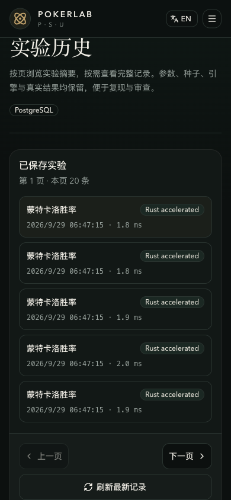

# Experiment history and lossless exports / 实验历史与无损导出

The ledger is a read-only view of saved API experiments. It does not recompute results, alter solver behavior, or change stored records. No database migration is required for this update; the existing `(created_at, id)` index supports paging.

台账是已保存 API 实验的只读视图，不重新计算结果、不改变求解器行为，也不修改已存记录。本次更新无需数据库迁移，分页使用已有的 `(created_at, id)` 索引。

## Browser workflow / 浏览器使用

Open **Experiments / 实验历史**. Each page contains up to 20 summaries, ordered newest first. Select a row to load its complete original JSON. Previous/Next changes pages; **Refresh latest records / 刷新最新记录** returns to the newest page. The storage badge reports SQLite or PostgreSQL from the responding database session; failures show an unconfirmed state instead of guessing.

打开 **Experiments / 实验历史**，每页最多显示 20 条摘要，按时间倒序排列。选中记录后才获取完整原始 JSON；上一页/下一页用于翻页，**Refresh latest records / 刷新最新记录** 返回最新一页。存储标识由实际响应请求的数据库会话提供，失败时显示“未确认”，不会猜测为 SQLite。

Loading, empty history, failed history, and failed detail are distinct states. Retry does not change saved data. A clipboard permission failure keeps the download option available. Changing records cancels obsolete requests; a late response cannot replace the newly selected record. English and Chinese labels follow the language switch; dates use that language's formatting and the browser's local time zone.

加载中、历史为空、历史失败、详情失败分别展示；重试不修改已存数据。剪贴板权限失败时仍可下载。切换记录会取消过时请求，迟到的响应不会覆盖当前记录。中英文文案跟随语言切换；日期使用对应语言格式和浏览器本地时区。

Offline requests fail visibly instead of remaining silently paused. Restore connectivity and use Retry; cached records remain available when already loaded.

断网请求会明确显示失败，不会静默暂停。恢复连接后点击“重试”；已有缓存记录会继续保留。

Mobile Chinese view / 移动端中文界面

Actual seeded API results from an isolated PostgreSQL test deployment. / 来自隔离 PostgreSQL 测试部署的真实固定种子 API 结果。

## API contract / API 契约

| Route / 路径 | Contract / 契约 |
| --- | --- |
| `GET /experiments/page?limit=20&cursor=…` | Metadata only, default 20 and maximum 100 rows; `next_cursor: null` means the final page. Invalid limits/cursors return 422. / 仅返回元数据，默认 20、最多 100 条；游标为 null 表示末页，非法参数返回 422。 |
| `GET /experiments/{id}/export` | Complete, indented UTF-8 JSON with attachment and `no-store` headers; missing records return 404. / 返回完整缩进 UTF-8 JSON，带附件与禁止缓存响应头；记录不存在返回 404。 |
| `GET /experiments` and `GET /experiments/{id}` | Existing full-record JSON contracts remain unchanged. / 旧版完整记录 JSON 契约不变。 |

A summary contains `id`, `experiment_type`, `seed`, `engine`, `runtime_ms`, and an explicit UTC `timestamp`. It intentionally omits parameters and results. The top-level response also contains `database` and `next_cursor`. Summary seeds are decimal **strings** (or null) so all API-accepted values through `9223372036854775807` survive browser transport. Full-record exports retain the existing **integer** schema, including any nested seeds.

摘要包含 `id`、`experiment_type`、`seed`、`engine`、`runtime_ms` 和明确 UTC 的 `timestamp`，故意省略参数与结果。响应顶层还包含 `database` 和 `next_cursor`。摘要种子使用十进制**字符串**（或 null），保证最大 `9223372036854775807` 在浏览器传输中不丢精度；完整导出保留原有**整数**结构，包括嵌套种子。

Treat cursors as opaque tokens: pass the returned value back, URL-encoded. Ordering uses `(created_at DESC, id DESC)`, including equal timestamps. Newer inserts cannot move a previously issued boundary, and a deleted boundary row does not prevent continuation. A cursor is not authentication and does not freeze a snapshot: externally inserted backdated records can appear later, deleted rows disappear, and returning to a previous page can show newer data. Refresh to restart from the latest state. No count of the entire database is claimed.

请将游标视为不透明值，进行 URL 编码后原样传回。排序为 `(created_at DESC, id DESC)`，相同时间戳也保持确定顺序。较新的插入不会移动已签发边界，删除边界行不影响继续分页。游标不是身份认证，也不是冻结快照：外部补写旧时间记录可能出现在后续页，已删除记录会消失，返回旧页时可能看到更新后的数据。刷新可从最新状态重新开始；页面不宣称展示整个数据库的总条数。

## Reproduction and limits / 复现与限制

Copy and download use the same server-returned JSON text. Do not parse the export with JavaScript `JSON.parse` and then reserialize it if exact large integers matter; use an integer-preserving parser, such as Python's standard `json` module. Pretty printing is performed by the API before browser delivery. Existing stored outcomes, timestamps, seeds, and selected-engine attribution are unchanged.

复制与下载使用同一份服务端 JSON 文本。需要保留大整数时，不要先用 JavaScript `JSON.parse` 再重新序列化；请使用能保留整数的解析器，例如 Python 标准 `json` 模块。缩进格式由 API 在发送前生成；已有结果、时间戳、种子和实际引擎标识均不改变。

Summary pages are bounded and avoid reading large JSON columns; a selected full export is still loaded as one response, not streamed or truncated. Exceptionally large single results can therefore use significant browser memory. The legacy bulk endpoint still includes complete results for compatibility. The API remains local-first and unauthenticated: keep loopback/private-network defaults, and use an authenticated gateway for shared deployments. See [security guidance](../SECURITY.md).

摘要页有条数上限且不会读取大型 JSON 列；选中记录的完整导出仍作为一个响应加载，不流式传输，也不截断。异常大的单条结果仍可能占用较多浏览器内存。旧批量接口为兼容性继续返回完整结果。API 仍为本地优先且没有内置认证：请保持回环/私网默认配置，共享部署使用带认证的网关。详见[安全指南](../SECURITY.md)。
