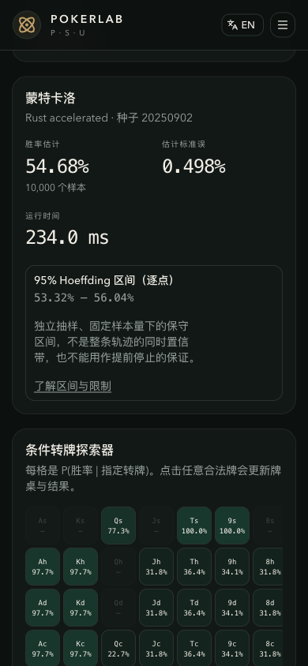

# Monte Carlo estimation / 蒙特卡洛估计

## Samples and reproducibility / 抽样与复现

Each independent legal runout produces an equity score, with ties counting as half a win:

每次独立抽取合法补牌得到一个胜率得分，平局计半胜：

$$
X_i \in \{0,\tfrac12,1\},
\qquad
\widehat E_n = \frac{1}{n}\sum_{i=1}^n X_i.
$$

Cards are sampled without replacement **within** a runout, but a runout can recur across independent trials. All stochastic endpoints accept an integer seed. The same inputs, seed, and sampler version reproduce the same samples and estimates; the Rust evaluator and Python fallback use the same sampling orchestration. Runtime is not deterministic.

单次补牌内部**不放回**抽牌，但不同试验可重复同一补牌组合。随机接口接受整数种子；相同输入、种子和抽样器版本复现相同样本与估计。Rust 评估器和 Python 回退共用抽样流程；运行耗时不保证相同。

## Estimated standard error / 估计标准误

For $n\ge2$, the unbiased sample variance and estimated standard error are:

当 $n\ge2$ 时，无偏样本方差和估计标准误为：

$$
s^2 = \frac{1}{n-1}\sum_{i=1}^n (X_i-\widehat E_n)^2,
\qquad
\operatorname{SE}(\widehat E_n)=\frac{s}{\sqrt n}.
$$

At $n=1$, both fields are **null**, not zero. Identical observations at $n\ge2$ give zero sample variance, but do not prove that unseen outcomes are impossible. Standard error is descriptive here; it does not determine the displayed confidence interval.

当 $n=1$ 时，两个字段均为 **null**，而不是零。$n\ge2$ 且观察结果完全相同时，样本方差为零，但不能证明未观察到的结果不可能发生。此处标准误是样本统计量，不用于计算展示的置信区间。

## Finite-sample confidence / 有限样本置信区间

New fixed-hand Monte Carlo results use a two-sided **Hoeffding interval**, valid for bounded scores including ties. Inverting Hoeffding's inequality for independent scores in $[0,1]$ gives:

新的固定手牌蒙特卡洛结果采用双侧 **Hoeffding 区间**，适用于含平局的有界得分。对独立的 $[0,1]$ 得分，将 Hoeffding 不等式反解得：

$$
P(|\widehat E_n-E|\ge r)\le2e^{-2nr^2},\qquad
r_n=\sqrt{\frac{\ln(2/0.05)}{2n}},\qquad
I_n=[\max(0,\widehat E_n-r_n),\min(1,\widehat E_n+r_n)].
$$

See the [Hoeffding derivation](https://ai.stanford.edu/~gwthomas/notes/concentration.html#hoeffding). The interval is deliberately conservative and does not rely on a normal approximation or treat half-win ties as binomial successes. With one sample it is always `[0, 1]`. At 100 samples its unclipped half-width is about **13.58 percentage points**; at 10,000 samples it is about **1.36 percentage points**.

参见 [Hoeffding 推导](https://ai.stanford.edu/~gwthomas/notes/concentration.html#hoeffding)。区间刻意保守，不依赖正态近似，也不把半胜平局当作二项成功次数。一个样本时总是 `[0, 1]`；100 个样本时，未截断半宽约 **13.58 个百分点**，10,000 个样本时约 **1.36 个百分点**。

- **Fixed sample count:** under independent, identically distributed trials, each prespecified $n$ has at least 95% repeated-sampling coverage. This is not a 95% posterior probability that the fixed true equity lies inside a realized interval.
- **Pointwise, not simultaneous:** chart checkpoints each have this interpretation, but the entire path is not a 95% simultaneous band. Inspecting the path and choosing when to stop or which seed to report does not preserve this guarantee.
- **Interpolation is only visual:** lines connect real checkpoints, with a 0–100% axis. They are not additional evaluated samples. More samples shrink the theoretical radius as $n^{-1/2}$, though the center moves.
- **Exact is separate:** exact legal-runout enumeration remains unchanged and has no Monte Carlo sampling error. The bound does not cover model mismatch, evaluator defects, biased/correlated sampling, or real-world poker prediction.

- **固定样本量：**在独立同分布试验假设下，每个预先指定的 $n$ 具有至少 95% 的重复抽样覆盖率。这不是“固定真实胜率有 95% 后验概率位于某个已算区间内”。
- **逐点而非同时：**每个图表检查点各自适用，但整条轨迹不是 95% 同时置信带。看结果后决定停止时间或挑选种子，不保留此保证。
- **连线仅用于展示：**连线连接真实检查点，坐标范围为 0–100%，不代表新增已评估样本。理论半径随 $n^{-1/2}$ 缩小，但估计中心会移动。
- **精确枚举独立：**精确补牌枚举不变，没有蒙特卡洛抽样误差。区间不覆盖模型偏差、评估器缺陷、有偏/相关抽样或真实对局预测误差。

## API and export compatibility / API 与导出兼容性

`POST /equity/monte-carlo` and `POST /research/monte-carlo` return `ci_low`, `ci_high`, and the existing checkpoint schema, with explicit metadata:

上述两个接口保留区间端点和检查点结构，新增明确的方法元数据：

```json
{
  "confidence_level": 0.95,
  "confidence_method": "hoeffding_v1",
  "confidence_scope": "pointwise_fixed_n"
}
```

The statistical interpretation of `ci_low`/`ci_high` changes from the previous normal approximation. Consumers must inspect the method metadata. `sample_variance` and `standard_error` now accept null for one sample; for larger samples their computation is unchanged. Point estimates, win/tie/lose counts, seeds, checkpoint locations, and exact results are unchanged.

`ci_low`/`ci_high` 的统计含义由旧版正态近似改为上述方法，消费者应检查方法元数据。`sample_variance` 和 `standard_error` 在单样本时允许 null，更多样本时计算不变。点估计、胜/平/负次数、种子、检查点位置和精确结果均不变。

New saved records and JSON exports retain the method fields. Existing records are **not rewritten** or relabeled; a result without metadata is not a Hoeffding result. Research convergence CSV rows include seed, engine, experiment ID, total sample count, and the three method fields. Retrieve the full experiment JSON for the original card parameters. No database migration is needed. Range-equity results and the separate synthetic-agent Student-t intervals are outside this change.

新记录和 JSON 导出保留方法字段；旧记录**不改写**、不重新标注，无元数据的结果不能解释为 Hoeffding 结果。研究收敛 CSV 每行包含种子、引擎、实验 ID、总样本数及三个方法字段；原始牌面参数可从完整实验 JSON 获取。无需数据库迁移。本次不改变范围胜率结果或合成代理基准的 Student-t 区间。

## Verified mobile result / 移动端实测结果

This screenshot is a real API run of `As Ks` vs `Qh Qd` on `Js 8s 2c`: 10,000 samples, seed `20250902`, Rust evaluator. The interval is 53.32%–56.04%, around the 54.68% sample estimate; exact enumeration gives 54.44%. Runtime varies by machine and load.

截图来自真实 API：`As Ks` 对 `Qh Qd`，公共牌 `Js 8s 2c`，10,000 个样本，种子 `20250902`，Rust 评估器。样本估计 54.68%，区间 53.32%–56.04%；精确枚举为 54.44%。运行时间随机器和负载变化。


